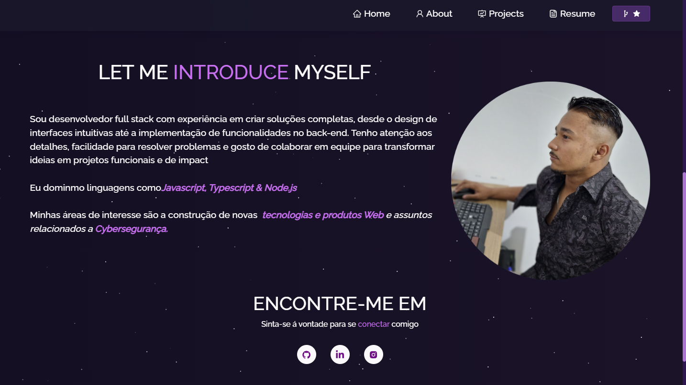

<h1 align="center" style="text-align: center;">
  PORTFÓLIO - KAYQUE DE JESUS
</h1>

> Portfólio desenvolvido para meu perfil.

  <a href="#project">Projeto</a>&nbsp;&nbsp;&nbsp;|&nbsp;&nbsp;&nbsp;
  <a href="#technologies">Tecnologias</a>&nbsp;&nbsp;&nbsp;|&nbsp;&nbsp;&nbsp;
  <a href="#usage">Utilização</a>&nbsp;&nbsp;&nbsp;|&nbsp;&nbsp;&nbsp;
  

  

<h2 id="project">📁 Projeto</h2>

Portfólio desenvolvido em React, com foco em design responsivo, interatividade e performance. Utiliza animações com partículas, efeitos visuais modernos e integração com o GitHub. Recursos como geração e visualização de PDF também estão presentes.

<h2 id="technologies">💻 Tecnologias</h2>

Este projeto foi desenvolvido utilizando tecnologias como:

- React
- React-Bootstrap
- Bootstrap
- React Icons
- React Parallax Tilt
- Typewriter Effect
- React PDF
- React GitHub Calendar
- Axios

<h2 id="license">📝 Licença</h2>

Este projeto está sob a licença MIT.

---

Contate-me

  
  
  
  

